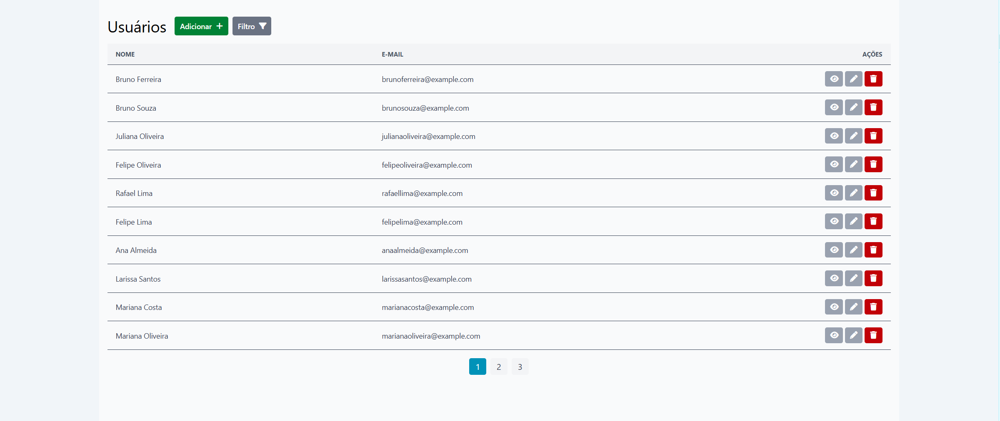
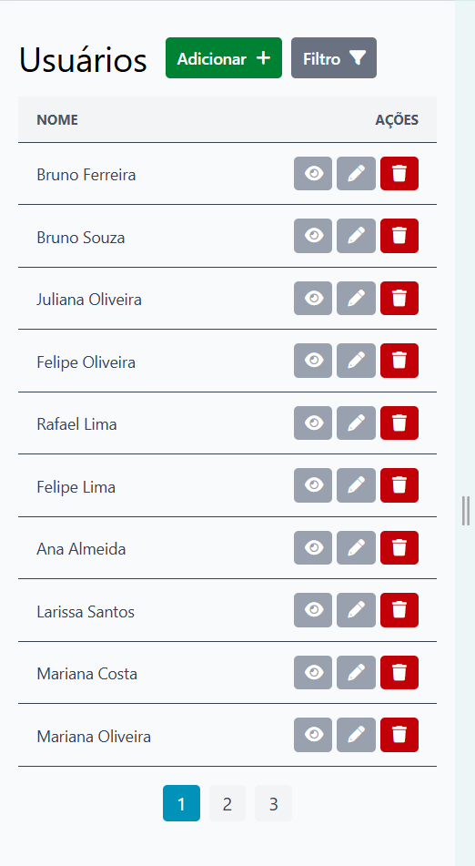

# Logical Mind Challenge (Frontend)

> Projeto de desafio técnico frontend desenvolvido em Vue 3 com TypeScript e Tailwind, focado em gestão de usuários (CRUD).




## Tecnologias obrigatórias:

- **Vue 3**
- **TypeScript**
- **TailwindCSS**

## Como Rodar Localmente

### Versão do node utilizada

```bash
node v22.14.0
```

### 1. Clonar o repositório

```bash
git clone https://github.com/filiperaupp/logical-mind-challenge.git
cd logical-mind-challenge
```

### 2. Rodar o projeto

```bash
npm install
npm run dev
```

### 3. Rodar com Docker de desenvolvimento (alternativa)

```bash
npm run dev:docker
```

A aplicação ficará acessível em `http://localhost:5173`

### Executar testes unitários

```bash
npm run test:unit
```

## Decisões Técnicas

Estrutura: Type-based folder structure => O projeto segue uma arquitetura por tipos/responsabilidades, agrupando arquivos de acordo com sua função (components, compositions, store, views, etc), indicada para projetos de pequeno e médio porte.

MirageJS => A API é simulada com MirageJS, que permite uma representação próxima a uma API real e possui fácil configuração.

Vee-Validate + Yup => Vee-validate possui composições para trabalhar com Vue 3, e fácil integração com o Yup para validação dos formulários.

Pinia => biblioteca de gerenciamento de estado da aplicação, que facilita a comunicação entre componetnes.

Vite + Vitest => ferramentas de bundler e test, recomendadas pelo ecossistema Vue.

Axios: biblioteca para facilitar configuração e manipulação de requisições.

Observações finais:

- Os dados mockados são gerados aleatóriamente. Caso a aplicação seja atualizada (F5) ou reiniciada (`npm run dev`), os dados serão gerados novamente.

- O tempo de espera pra cada requisição está fixado em 1,5 segundos para que seja possível visualizar o loading das ações. Esse valor pode ser alterado no arquivo `src/utils/mirage.ts`.

```ts
createServer({
    ...,
    routes() {
      ...,
      this.timing = 1500
      ...
    }
})
```

- Foi adicionado uma validação, a fins de testes, onde o usuário com ID 1 não pode ser excluído, apenas para facilitar a visualização do componente de toast para erros. A mesma pode ser removida no arquivo `src/utils/mirage.ts`.

```ts
createServer({
    ...,
    routes() {
      ...,
      this.delete(...) => {
        ...,
        // Comentar esse trecho para remover validação
        if (Number(user.id) === 1)
          return new Response(400, undefined, {
            message: 'O usuário com ID 1 não pode ser excluído',
          })
        ...,
    }
})
```

---
